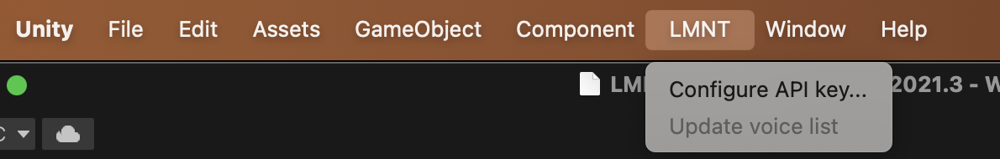
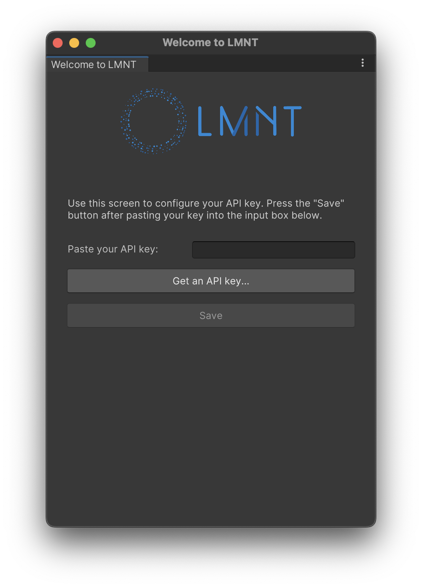
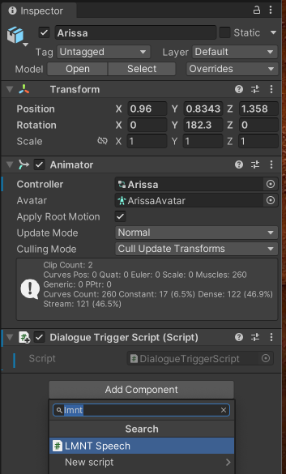
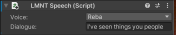

## Configuring the package
Once you've added the package to your project (see [Installation Guide](installation-guide.md)), you'll need to configure
it with an API key.

Select `LMNT > Configure API Key...` from the menu bar.



You can get a new API key or find your current key by pressing the `Get an API key...` button.



Once you've pasted your key into the input box, press the `Save` button to continue. That's it!
You're all set to add dialogue to your game objects.

## Adding dialogue to a `GameObject`
Select a `GameObject` that you want to speak, and add an `LMNT Speech` Component in the Inspector.



Now, choose a voice from the drop-down list and write some text you'd like the `GameObject` to say.



## Triggering dialogue from a script

Now that your `GameObject`'s dialogue is configured, you can trigger it from a script. The easiest way
to do that is by adding the following code to your `MonoObject`:

```csharp
public class MyScript : MonoBehaviour {
  private LMNTSpeech speech;

  void Start() {
    // ... your code here ...
    speech = GetComponent<LMNTSpeech>();
  }

  void Update() {
    // ... your code here ...
    StartCoroutine(speech.Talk());
  }
}
```

For a detailed example, you can read through the `DialogueTriggerScript.cs` file in the LMNT package.
